# My Experience — 个人项目集合

> AI 应用（RAG 检索增强 / 多智能体协作 / LLM 应用）＋ Java 全栈（Spring Boot + Vue）两条主线的个人项目集合，共 5 个项目，每个都可独立运行。

本仓库收录我在课余时间独立完成的 5 个项目，目的是完整走一遍 **需求 → 设计 → 实现 → 调试 → 文档** 的工程流程，而不是"跑通一个 demo"。每个项目都配有清晰的运行步骤、运行截图与常见问题整理，尽量做到 clone 下来就能跑起来。

## 项目速览

| # | 项目 | 方向 | 核心技术 | 亮点 |
|---|------|------|---------|------|
| 1 | AI Partner — 花菜聊天伴侣 | LLM 应用 | Python · Streamlit · DeepSeek | 5 种 AI 人格、24 款头像、多模型切换、流式输出 |
| 2 | 多智能体软件开发团队 | AI Agent | Python · Microsoft AutoGen · Streamlit | 6 个 Agent 走完整软件流程，生成代码真实落盘并运行 |
| 3 | JoJolands RAG | RAG | LangChain · FAISS · BGE · BM25 | 176 个 JOJO 角色，混合检索 + 对比实验 |
| 4 | 苍穹外卖 Sky Take-Out | Java 后端 | Spring Boot · Redis · WebSocket · 小程序 | O2O 外卖平台，用户端 + 商家端后端 |
| 5 | VIP 会员管理系统 | Java 全栈 | Spring Boot 3.4 · Vue 3 · Element Plus | 纯手写全栈后台，4 大业务模块 |

## 能力体现

这 5 个项目有意覆盖两条主线，集中体现以下能力：

- **LLM 应用工程**（AI Partner / 多智能体团队）：Prompt 设计、流式输出、多轮记忆、多模型适配、会话持久化与导出
- **RAG 全链路**（JoJolands RAG）：文档加载 → 递归分块 → BGE 向量化 → FAISS 索引 → BM25 + 向量混合检索 → LLM 生成，并做了检索方案对比实验
- **多智能体（Agent）架构**（多智能体团队）：角色分工、编排顺序、终止条件与轮次控制；为 Agent 接入**代码执行器**，赋予其"工具调用 + 本地文件写入"能力
- **Prompt Engineering**：角色提示（Role Prompting）、结构化输出约束、工具调用（Function Calling）思路，能针对不同场景设计提示策略
- **Java 后端工程**（苍穹外卖 / VIP 系统）：Spring Boot 分层开发、MyBatis-Plus、JWT 鉴权、Redis 缓存、WebSocket 实时推送、阿里云 OSS 对象存储
- **前端与全栈**（VIP 系统）：Vue 3 + Element Plus 构建 SPA、Axios 统一拦截器、静态资源本地化，独立完成后端接口与前后端联调
- **工程规范与文档**：Git 提交规范、逐项目 README、统一的运行步骤与常见问题整理，遇到环境/依赖问题能自行定位并沉淀为文档

---

## 环境准备（所有项目通用）

| 工具 | 用途 | 下载 |
|------|------|------|
| **VS Code** / PyCharm | Python 项目（AI-partner、multi-agent-team、jojo-rag） | [VS Code](https://code.visualstudio.com/) · [PyCharm](https://www.jetbrains.com/pycharm/download/) |
| **IntelliJ IDEA** | Java 项目（cangqiongwaimai、vip_system） | [IDEA](https://www.jetbrains.com/idea/download/) |
| **JDK 21+** | Java 编译运行 | [Oracle JDK](https://www.oracle.com/java/technologies/downloads/) |
| **MySQL 8.0+** | 数据库 | [MySQL](https://dev.mysql.com/downloads/mysql/) |
| **Redis（Windows）** | 苍穹外卖缓存 | [Redis for Windows](https://github.com/tporadowski/redis/releases) |
| **Nginx（Windows）** | 苍穹外卖前端部署 | [Nginx](https://nginx.org/en/download.html) |
| **Git** | 版本管理 | [Git](https://git-scm.com/download/win) |
| **微信开发者工具** | 苍穹外卖小程序端 | [下载](https://developers.weixin.qq.com/miniprogram/dev/devtools/download.html) |

### DeepSeek API Key（Python 项目通用）

三个 Python 项目共用 DeepSeek API。在 [DeepSeek 开放平台](https://platform.deepseek.com/) 注册获取 Key。

```bash
# 设置环境变量（Windows PowerShell）
$env:DEEPSEEK_API_KEY="sk-xxxxxxxxxxxxxxxxxxxxxxxxxxxxxxxx"
```

> 每个 Python 项目也有独立的 `.env.example`，复制为 `.env` 后填入 Key 即可。

---

## 1. AI Partner — 花菜智能聊天伴侣

**打开方式**：用 VS Code 或 PyCharm 打开 `AI-partner/` 目录。

```
Python · Streamlit · DeepSeek API · OpenAI SDK
5 种 AI 人格 / 24 款头像 / 流式输出 / 会话持久化
```

### 运行步骤

```bash
# 1. 进入项目目录
cd AI-partner

# 2. 创建虚拟环境（推荐，避免依赖冲突）
python -m venv venv

# 3. 激活虚拟环境
# Windows PowerShell:
venv\Scripts\Activate.ps1
# Windows CMD:
venv\Scripts\activate.bat

# 4. 安装依赖
pip install -r requirements.txt

# 5. 配置 API Key（二选一）
# 方式 A：复制模板文件并编辑
copy .env.example .env
# 然后用记事本打开 .env，填入你的 DEEPSEEK_API_KEY

# 方式 B：直接设置环境变量（见上方"DeepSeek API Key"章节）

# 6. 启动应用
streamlit run main.py

# 浏览器自动打开 http://localhost:8501
```

<details>
<summary>📸 运行截图</summary>

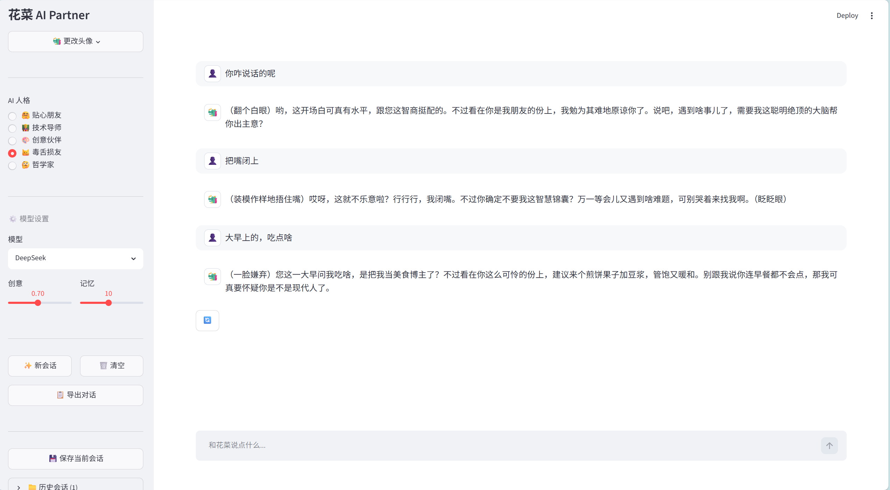

</details>

---

## 2. 多智能体软件开发团队

**打开方式**：用 VS Code 或 PyCharm 打开 `multi-agent-team/` 目录。

```
Python · Microsoft AutoGen · Streamlit · DeepSeek API
6 个 AI Agent + 代码执行器 / 单步人工审核 / 代码真实落盘运行
```

> 与"只输出文本"的对话式 AI 不同：这里的 Agent 能把生成的项目代码**真正写入本地磁盘并运行**，再把运行结果回传给测试环节——具备"工具调用 + 本地文件写入"能力，而不只是给出一段文本建议。

### 运行步骤

```bash
# 1. 进入项目目录
cd multi-agent-team

# 2. 创建并激活虚拟环境
python -m venv venv
venv\Scripts\Activate.ps1   # PowerShell
# 或 venv\Scripts\activate.bat   # CMD

# 3. 安装依赖
pip install -r requirements.txt

# 4. 配置 API Key
copy .env.example .env
# 编辑 .env，填入 LLM_API_KEY（默认 DeepSeek，可换成任意 OpenAI 兼容模型）

# 5. 启动（Streamlit 交互页面）
streamlit run main.py
# 浏览器打开 http://localhost:8501
# 若 streamlit 命令不可用，改用：python -m streamlit run main.py
```

### 使用说明

1. 输入需求描述，点「开始开发」。
2. 系统按角色**逐步执行**：需求分析 → 系统设计 → UI/UX 设计 → 编码实现（含真实执行）→ 测试与质量 → 汇总报告。
3. 每个环节产出后**暂停**：可「通过」进入下一步，或「提交反馈」让当前角色重新生成。
4. 到「编码实现」阶段，生成的项目代码会写入 `coding/` 目录并自动运行、自动启动网页预览。
5. 全部通过后生成结构化的「软件开发过程报告」，可下载 Markdown。

<details>
<summary>📸 运行截图</summary>

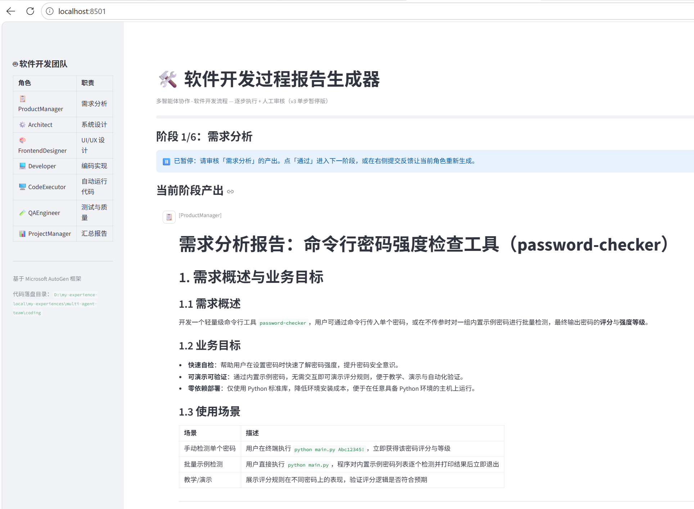
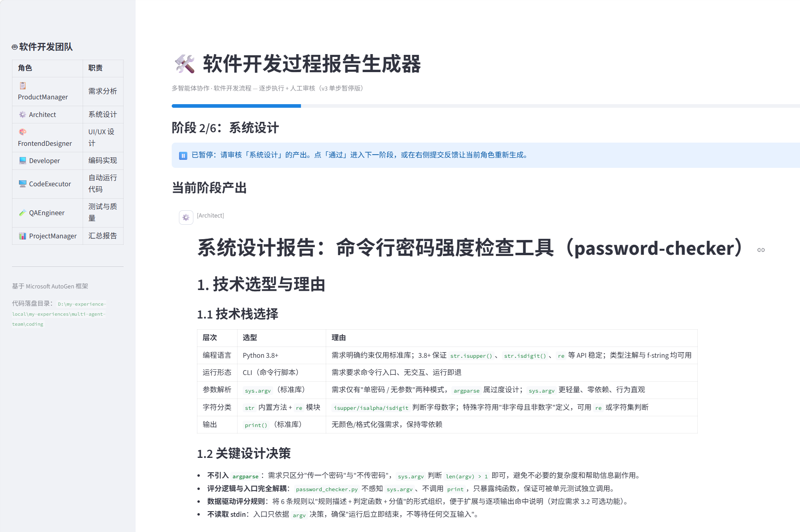
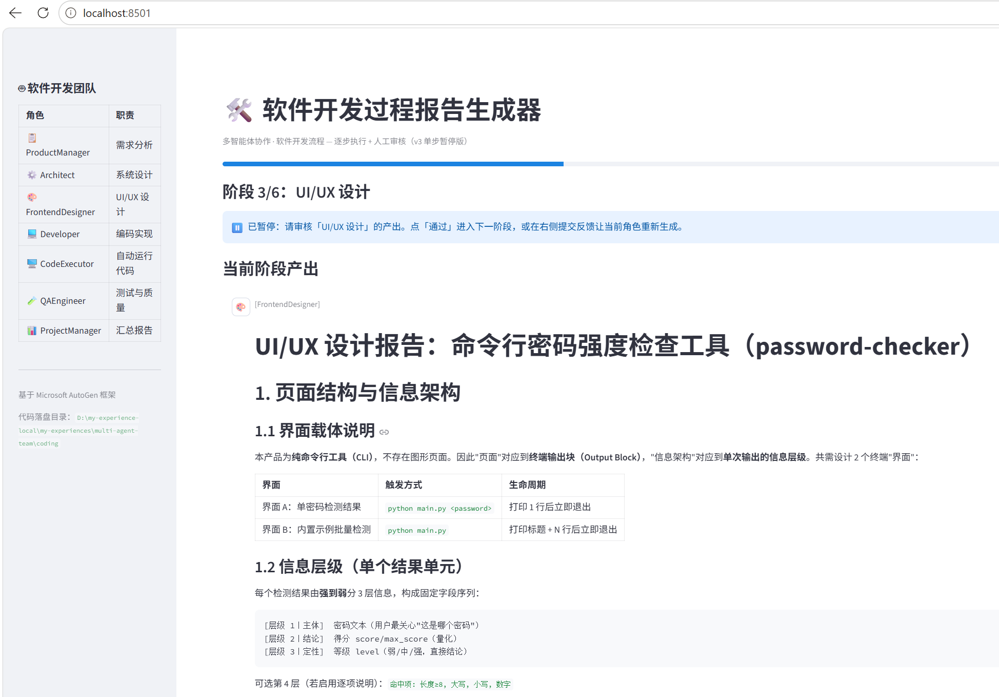
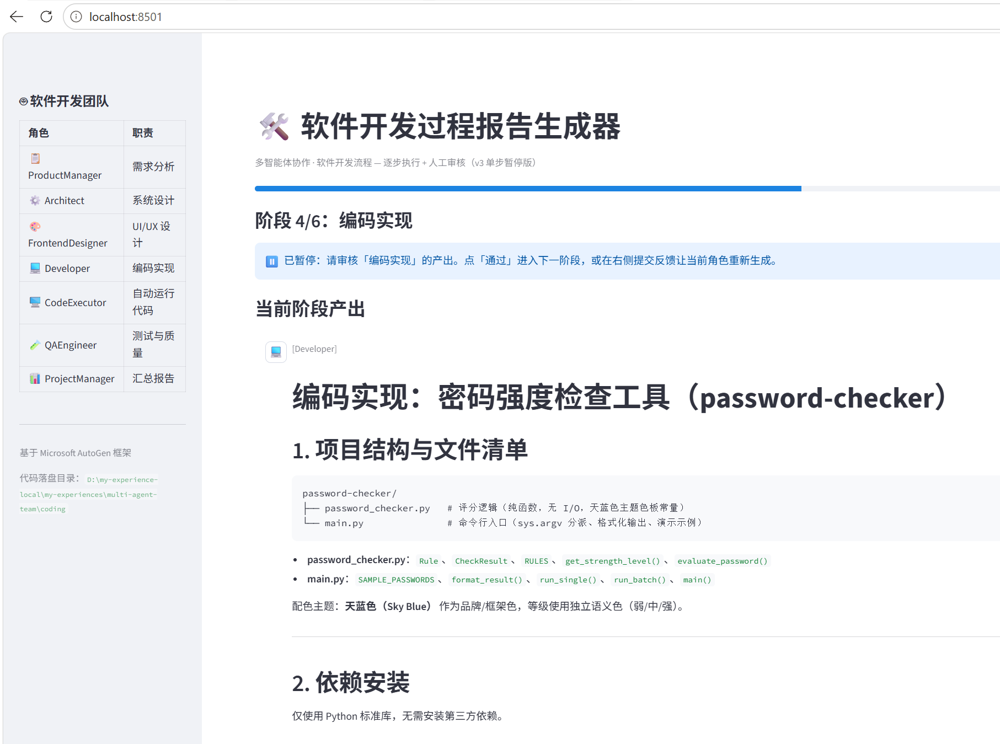
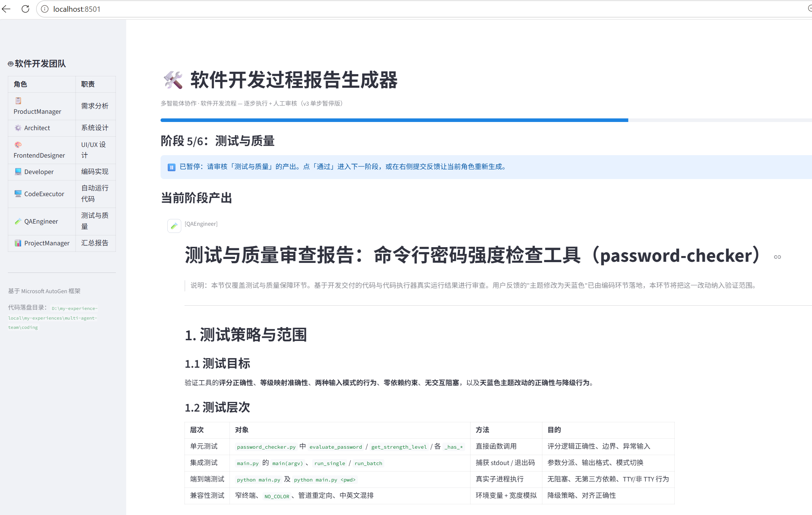
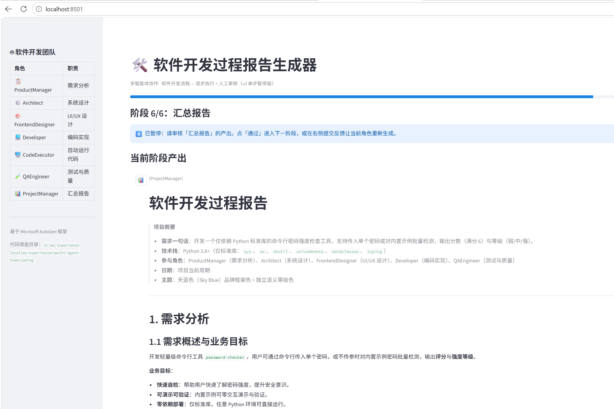

</details>

---

## 3. JoJolands RAG — JOJO 角色知识问答

**打开方式**：用 VS Code 或 PyCharm 打开 `jojo-rag/` 目录。

```
Python · LangChain · FAISS · BGE Embedding · BM25 · DeepSeek API
176 个 JOJO 角色 · RAG 检索增强生成问答
```

### 运行步骤

```bash
# 1. 进入项目目录
cd jojo-rag

# 2. 创建并激活 conda 环境（仅首次）
conda create -n jojo-rag python=3.11 -y
conda activate jojo-rag

# 3. 安装依赖（仅首次）
pip install -r requirements.txt

# 4. 配置 API Key
copy .env.example .env
# 编辑 .env，填入：
#   DEEPSEEK_API_KEY=你的Key
#   HF_ENDPOINT=https://hf-mirror.com
#   HF_HUB_OFFLINE=1            ← 模型已缓存时加此行跳过联网校验，加快启动

# 5. 启动
python main.py
```

> 后续使用时只需 `conda activate jojo-rag && python main.py`。

### 首次运行说明

首次运行会自动：
1. 下载 BGE-small-zh 向量模型（~400MB）
2. 加载 `data/pdf/` 下的 176 份角色 TXT 文档
3. 构建 FAISS 向量索引（保存为 `vectorstore/`，下次启动直接加载）
4. 进入交互式问答模式

输入问题即可查询 JOJO 角色信息，输入 `quit` 退出。

### 数据说明

知识库位于 `data/pdf/`，包含 176 份 TXT 文件，覆盖 JOJO 1-9 部所有出现且提到过名字的角色。

> 如需扩展数据：在灰机 wiki 角色分类页（https://jojo.huijiwiki.com/wiki/分类:角色）的浏览器控制台（F12）运行 `scraper.html` 中的 JS 脚本，抓取完成后将 txt 文件放入 `data/pdf/` 并重新运行 `python main.py`。

<details>
<summary>📸 运行截图</summary>

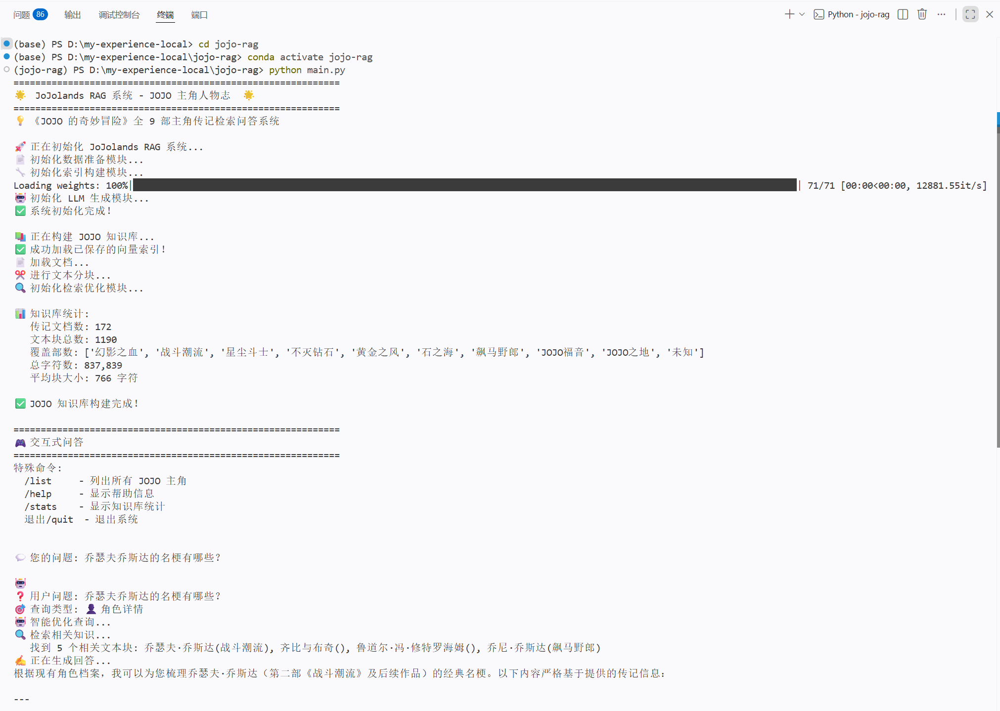
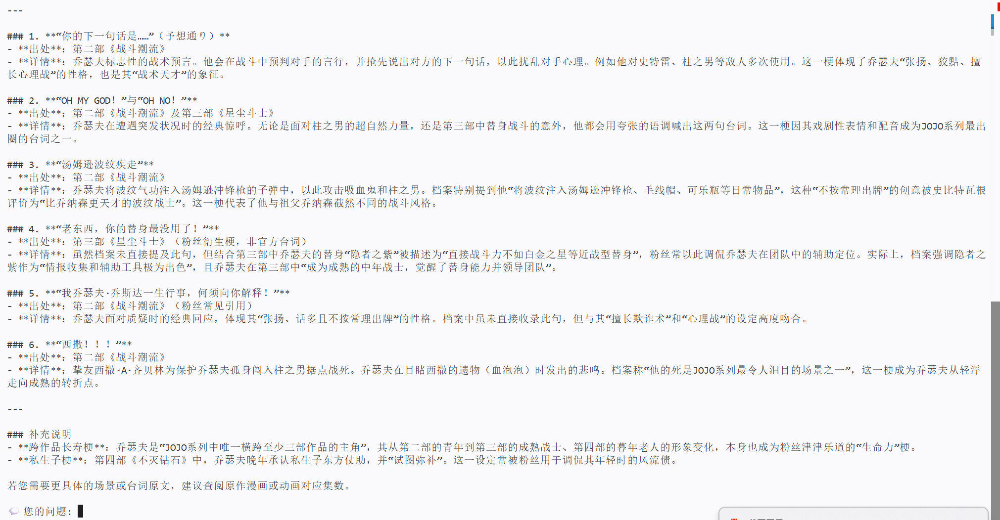

</details>

---

## 4. 苍穹外卖 — Sky Take-Out

**打开方式**：用 IntelliJ IDEA 打开 `cangqiongwaimai/sky-take-out/` 目录（Maven 项目）。

```
Spring Boot 2.7 · MyBatis-Plus · MySQL · Redis · JWT · WebSocket · 阿里云 OSS
O2O 外卖平台 / 用户端 + 商家管理端 + 微信小程序
```

### 运行步骤

```bash
# ═══ 1. MySQL 数据库 ═══
# 用 SQLyog / Navicat / MySQL CLI 连接本地 MySQL
# 新建数据库 sky_take_out（字符集 utf8mb4）
# 导入项目根目录的 sky_take_out.sql

mysql -u root -p
CREATE DATABASE sky_take_out DEFAULT CHARACTER SET utf8mb4;
USE sky_take_out;
SOURCE cangqiongwaimai/sky_take_out.sql;

# ═══ 2. Redis ═══
# 启动 Windows 版 Redis
redis-server.exe

# ═══ 3. 配置 ═══
# 编辑 sky-server/src/main/resources/application-dev.yml
# 修改以下配置为你的实际值：
#   - 数据库用户名/密码
#   - Redis 密码
#   - 阿里云 OSS 的 AccessKey（如不需要图片上传可跳过）
#   - 微信支付配置（如不需要支付功能可跳过）

# ═══ 4. 启动后端 ═══
# 在 IDEA 中右键 sky-server → Run 'SkyApplication'
# 或命令行：
cd cangqiongwaimai/sky-take-out
mvn clean install -DskipTests
cd sky-server
mvn spring-boot:run

# 后端启动后访问 http://localhost:8080

# ═══ 5. 启动前端（Nginx） ═══
# 将 front-environment/ 目录配置到 Nginx
# 编辑 nginx.conf，添加：
#   server {
#       listen 80;
#       location / {
#           root D:/my-experience-local/cangqiongwaimai/front-environment;
#           index index.html;
#       }
#   }
# 启动 Nginx: start nginx
# 前端访问 http://localhost

# ═══ 6. 微信小程序 ═══
# 安装微信开发者工具（https://developers.weixin.qq.com/miniprogram/dev/devtools/download.html）
# 用微信开发者工具打开 wx-miniprograme/ 目录
# 配置 AppID 后即可编译预览
```

### 测试账号

| 角色 | 账号 | 密码 |
|------|------|------|
| 管理端 | admin | 123456 |

<details>
<summary>📸 运行截图</summary>

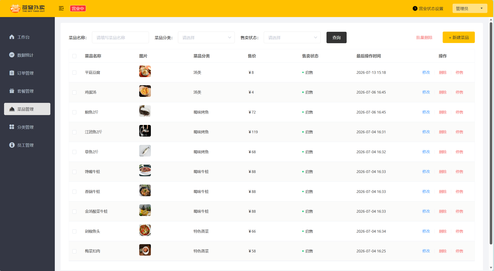
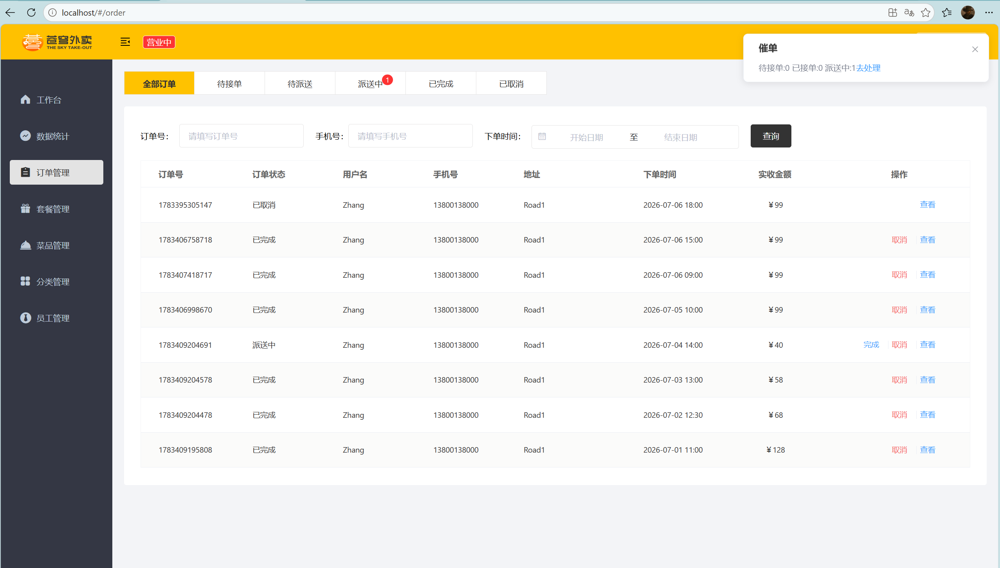
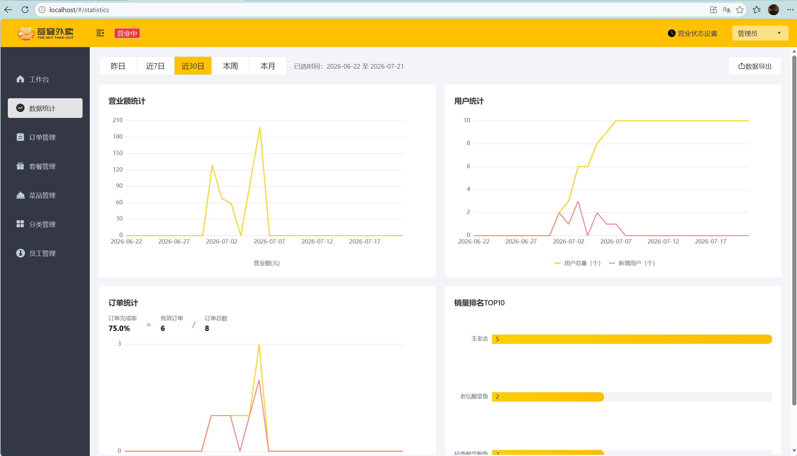

</details>

---

## 5. VIP 会员管理系统

**打开方式**：用 IntelliJ IDEA 打开 `vip_system/` 目录（Maven 项目）。

```
Spring Boot 3.4 · MyBatis-Plus · Vue 3 · Element Plus · MySQL · Druid
全栈会员管理后台 / 4 大模块
```

### 运行步骤

```bash
# ═══ 1. MySQL 数据库 ═══
# 连接本地 MySQL
mysql -u root -p

# 新建数据库
CREATE DATABASE vip_system DEFAULT CHARACTER SET utf8mb4;

# 导入项目根目录的 SQL 文件
USE vip_system;
SOURCE vip_system.sql;

# ═══ 2. 配置 ═══
# 编辑 src/main/resources/application.properties
# 修改数据库用户名和密码：
#   spring.datasource.username=root
#   spring.datasource.password=你的密码

# ═══ 3. 启动后端 ═══
# 在 IDEA 中打开 vip_system/，等待 Maven 依赖下载完成
# 右键 VipSystemApplication → Run
# 或命令行：
cd vip_system
mvn clean install -DskipTests
mvn spring-boot:run

# 后端启动后访问 http://localhost:9999

# ═══ 4. 访问前端 ═══
# 浏览器打开 http://localhost:9999/index.html
# 登录账号：admin / 123456

# 前端已内置在后端静态资源中（src/main/resources/static/），无需单独部署
```

### 测试账号

| 角色 | 账号 | 密码 |
|------|------|------|
| 管理员 | admin | 123456 |

### 功能模块

| 模块 | 功能 |
|------|------|
| 会员管理 | 增删改查、分页搜索、会员卡号管理 |
| 商品管理 | 商品信息维护、类别筛选 |
| 员工管理 | 员工档案、职位信息 |
| 供应商管理 | 供应商信息、供货关系 |

<details>
<summary>📸 运行截图</summary>

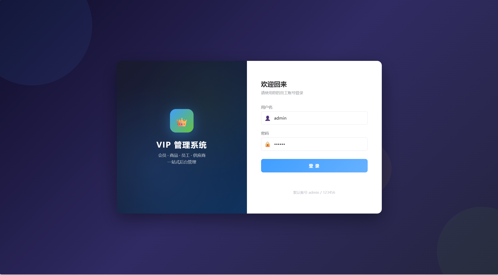
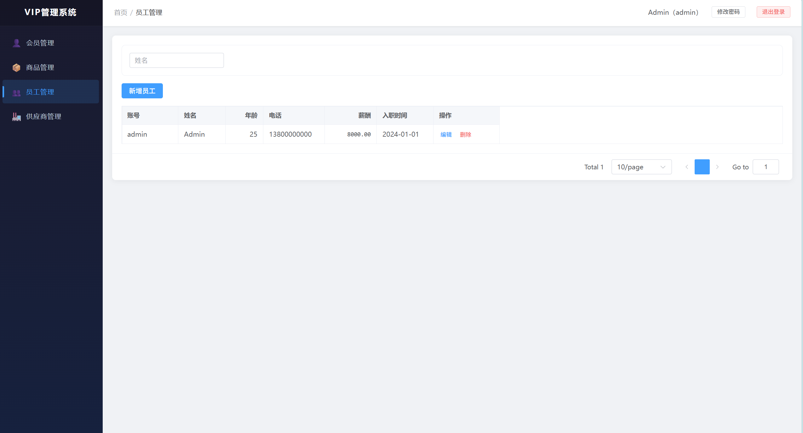

</details>

---

## 常见问题

### Q1：IDEA 打开 Java 项目后报 `ExceptionInInitializerError: TypeTag :: UNKNOWN`

**原因**：JDK 版本不匹配。`pom.xml` 中 `<java.version>` 配置的版本与 IDEA 使用的 JDK 版本不一致，Maven 编译器插件不支持当前 JDK 导致的内部错误。

**解决方法（三步）**：

```
1. 确认 JDK 版本
   打开终端执行：java -version
   确认输出为 21（本项目已统一配置为 JDK 21）

2. 在 IDEA 中设置 Project SDK
   File → Project Structure → Project → SDK → 选择 JDK 21
   File → Settings → Build, Execution, Deployment → Build Tools → Maven
     → Gradle JVM / JRE → 选择 JDK 21

3. 刷新 Maven
   右侧 Maven 面板 → 点击刷新按钮（Reload All Maven Projects）
   或命令行：mvn clean compile -U
```

> 如果仍未解决，删除项目 `target/` 目录，重新 `mvn clean install -DskipTests`。

### Q2：Python 项目 `pip install` 报 timeout / connection error

**原因**：PyPI 默认源在国内访问慢。

**解决方法**：

```bash
# 使用清华镜像源安装
pip install -r requirements.txt -i https://pypi.tuna.tsinghua.edu.cn/simple
```

### Q3：Streamlit 启动后浏览器不自动打开

手动访问 `http://localhost:8501` 即可。

### Q4：jojo-rag 首次运行卡在"下载模型"很久

BGE 模型约 400MB，国内下载慢。确保 `.env` 中已配置 `HF_ENDPOINT=https://hf-mirror.com`。

### Q5：Java 项目启动后报数据库连接失败（`Access denied` / `Unknown database`）

**原因**：配置文件中的数据库用户名/密码/库名使用的是模板占位符，需要改为你本地 MySQL 的实际值。

**需要修改的文件**：

| 项目 | 配置文件位置 | 需修改的行 |
|------|------|------|
| **苍穹外卖** | `cangqiongwaimai/sky-take-out/sky-server/src/main/resources/application-dev.yml` | `username`、`password`、`database` |
| **VIP系统** | `vip_system/src/main/resources/application.properties` | `spring.datasource.username`、`spring.datasource.password` |

**示例（VIP 系统）**：

```properties
# 模板中的默认值（不能直接使用）
spring.datasource.username=your_username
spring.datasource.password=your_password

# 改为你本地 MySQL 的实际账号密码
spring.datasource.username=root
spring.datasource.password=root
```

> 修改后重启项目即可。如果 MySQL 不是默认端口 3306，`application.properties` 第 9 行的 `spring.datasource.url` 也要同步修改端口号。
